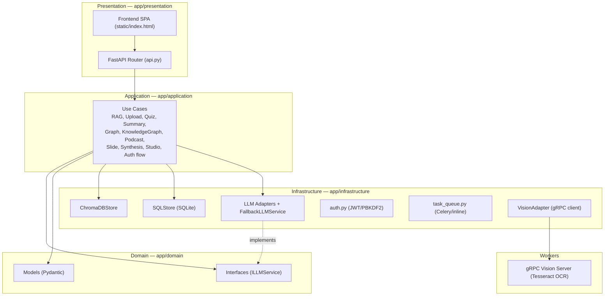
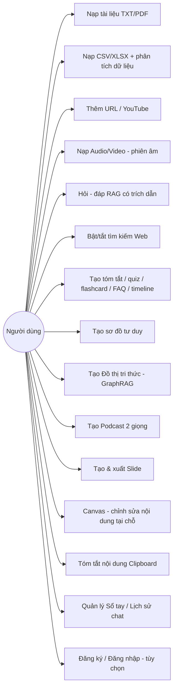
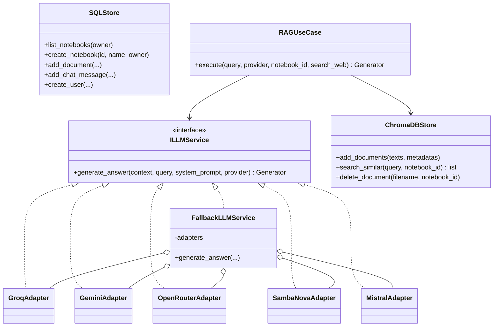
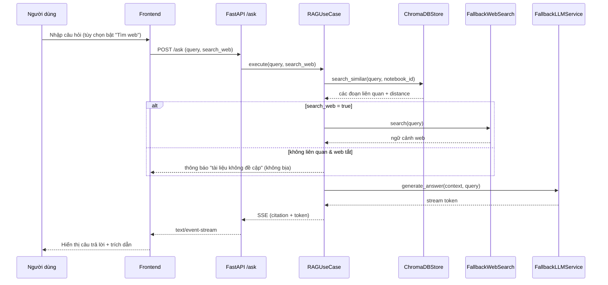
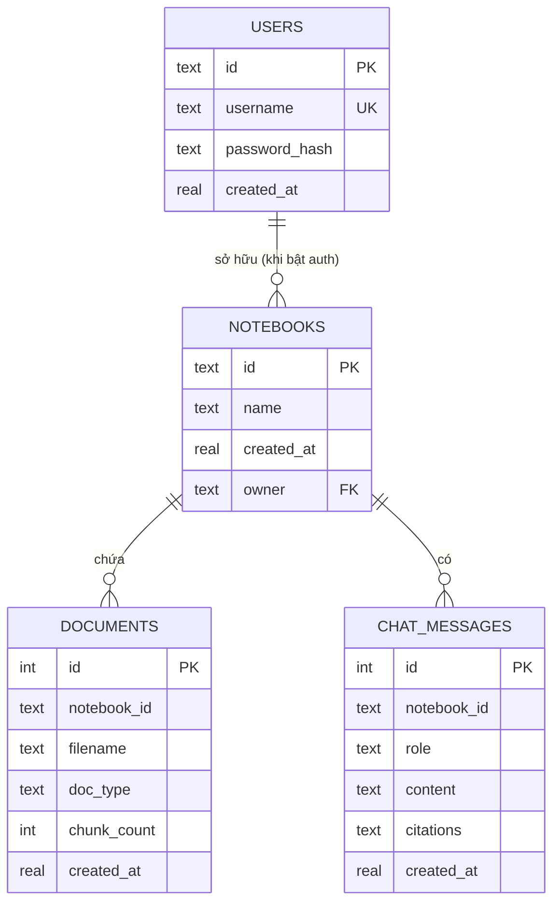

# BÁO CÁO ĐỒ ÁN — NBLM Research

> Hệ thống nghiên cứu tài liệu bằng AI theo phong cách NotebookLM, tự host.
> Môn: **Thiết kế phần mềm**. Tài liệu này dùng cho báo cáo & thuyết trình.

---

## 1. Tổng quan

**NBLM Research** là một ứng dụng web cho phép người dùng:
- Nạp tài liệu của riêng mình (PDF, TXT, CSV/XLSX, URL web, YouTube, audio/video).
- Trò chuyện hỏi–đáp dựa trên tài liệu đó (RAG – Retrieval-Augmented Generation) kèm trích dẫn nguồn.
- Sinh nội dung phái sinh: tóm tắt, trắc nghiệm, flashcard, sơ đồ tư duy, **đồ thị tri thức**, podcast 2 người, slide thuyết trình.
- Phân tích dữ liệu bảng (CSV/XLSX) bằng cách để AI tự viết Python (pandas/matplotlib) và vẽ biểu đồ.

Hệ thống được xây bằng **FastAPI** + kiến trúc **Clean Architecture**, dùng **ChromaDB** cho tìm kiếm ngữ nghĩa và **SQLite** cho dữ liệu quan hệ.

---

## 2. Mục tiêu & phạm vi

| Mục tiêu | Mô tả |
|----------|-------|
| Hỏi–đáp tài liệu | RAG có trích dẫn, streaming theo thời gian thực |
| Đa định dạng nguồn | TXT, PDF, CSV/XLSX, URL, YouTube, MP3/MP4 |
| Bộ công cụ tri thức | Tóm tắt, quiz, flashcard, FAQ, timeline, mindmap, GraphRAG |
| Sản phẩm đầu ra | Podcast (TTS 2 giọng), slide xuất PDF |
| Kiến trúc rõ ràng | Tách lớp, áp dụng design pattern, dễ kiểm thử & mở rộng |

---

## 3. Công nghệ sử dụng

| Lớp | Công nghệ |
|-----|-----------|
| Backend | Python 3.10+, FastAPI, Uvicorn, Pydantic |
| Tìm kiếm ngữ nghĩa | ChromaDB + sentence-transformers (`vietnamese-sbert`) |
| CSDL quan hệ | SQLite (thư viện chuẩn `sqlite3`) |
| LLM | Groq, Gemini, OpenRouter, SambaNova, Mistral (fallback tự động) |
| OCR | gRPC worker + Tesseract (`pytesseract`) |
| Thu thập web | Playwright, requests |
| Âm thanh | Edge-TTS (podcast), faster-whisper (phiên âm – tùy chọn) |
| Phân tích dữ liệu | pandas, matplotlib (chạy trong sandbox tiến trình con) |
| Tác vụ nền (tùy chọn) | Celery + Redis |
| Xác thực (tùy chọn) | JWT (HS256) + PBKDF2 — tự cài bằng thư viện chuẩn |
| Frontend | HTML/CSS/JS thuần + marked, KaTeX, Mermaid, vis-network, DOMPurify |

---

## 4. Kiến trúc tổng thể (Clean Architecture)

Dự án tách 4 lớp, phụ thuộc hướng vào trong (lớp ngoài phụ thuộc lớp trong, không ngược lại):



**Nguyên tắc**: nghiệp vụ (Application) không biết chi tiết hạ tầng; nó làm việc qua **giao diện** (`ILLMService`). Điều này cho phép thay LLM provider mà không sửa nghiệp vụ.

---

## 5. Các Design Pattern đã áp dụng

| Pattern | Vị trí | Vai trò |
|---------|--------|---------|
| **Adapter** | `groq_adapter.py`, `gemini_adapter.py`, … | Chuẩn hóa nhiều API LLM khác nhau về cùng giao diện `ILLMService` |
| **Strategy + Chain of Responsibility** | `FallbackLLMService` | Lần lượt thử Mistral → SambaNova → Gemini → Groq → OpenRouter cho tới khi thành công |
| **Repository** | `ChromaDBStore`, `SQLStore` | Đóng gói truy cập dữ liệu (vector & quan hệ) |
| **Dependency Injection** | `Depends(get_*_use_case)` trong FastAPI | Tiêm phụ thuộc, dễ thay thế khi test |
| **Facade** | các `*UseCase` | Mỗi use case gói một quy trình nghiệp vụ phức tạp sau một hàm `execute()` |
| **Producer–Consumer / Observer** | `event_queue` + `MemoryDaemon` (producer) / `VisionAdapter` (consumer) | Tách việc chụp màn hình khỏi việc OCR + lập chỉ mục |
| **Singleton** | các đối tượng khởi tạo ở module-level (`vector_store`, `sql_store`, `llm_service`) | Tái dùng model embedding & kết nối, tránh khởi tạo lại mỗi request |
| **Template/Factory nhẹ** | `get_*_use_case()` | Tạo use case với phụ thuộc đã lắp sẵn |

---

## 6. Nguyên lý SOLID

- **S — Single Responsibility**: mỗi use case một nhiệm vụ (RAGUseCase chỉ lo hỏi–đáp, UploadUseCase chỉ lo nạp tài liệu…).
- **O — Open/Closed**: thêm provider LLM mới = thêm 1 adapter, không sửa code cũ.
- **L — Liskov**: mọi adapter đều thay thế được nhau qua `ILLMService`.
- **I — Interface Segregation**: giao diện `ILLMService` nhỏ gọn, chỉ một phương thức cần thiết.
- **D — Dependency Inversion**: `RAGUseCase` phụ thuộc **trừu tượng** `ILLMService`, không phụ thuộc adapter cụ thể.

---

## 7. Sơ đồ Use Case



---

## 8. Sơ đồ lớp (rút gọn các lớp chính)



---

## 9. Sơ đồ tuần tự — Luồng hỏi–đáp RAG (`/ask`)



---

## 10. Mô hình dữ liệu quan hệ (SQLite)



> ChromaDB lưu **vector embedding + nội dung chunk** (tách khỏi CSDL quan hệ) để chuyên trách tìm kiếm ngữ nghĩa.

---

## 11. Danh mục tính năng

**Nạp dữ liệu**: TXT, PDF (kèm bảng), CSV/XLSX, URL web, YouTube (phụ đề), Audio/Video (Whisper – tùy chọn).

**Hỏi–đáp**: RAG streaming + trích dẫn; toggle 🌐 Tìm web (không "bịa" khi tắt); tool-calling (chạy Python, tải tài liệu từ URL).

**Intelligence Suite**: Tóm tắt, Trắc nghiệm, Flashcard, FAQ, Dòng thời gian, Cẩm nang ôn tập, Báo cáo, Sơ đồ tư duy (Mermaid), **Đồ thị tri thức (GraphRAG, vis-network)**.

**Sản phẩm**: Podcast 2 giọng (Edge-TTS), Slide điện ảnh (xuất PDF).

**Trải nghiệm**: Command Palette (`Ctrl+K`), Canvas Workspace (sửa AI tại chỗ), Tóm tắt Clipboard, thống kê sổ tay realtime, xuất hội thoại, sáng/tối.

**Quản trị**: Sổ tay (notebook) đa không gian, lịch sử chat lưu server, xác thực JWT đa người dùng (tùy chọn), tác vụ nền Celery/Redis (tùy chọn).

---

## 12. Bảng API (chính)

| Method | Endpoint | Chức năng |
|--------|----------|-----------|
| POST | `/ask` | Hỏi–đáp RAG (SSE streaming) |
| POST | `/upload` | Nạp TXT/PDF/CSV/XLSX/Audio/Video |
| POST | `/upload-url` | Nạp URL / YouTube |
| GET | `/summarize`, `/generate-quiz`, `/generate-graph` | Tóm tắt / quiz / mindmap |
| POST | `/studio/generate` | Flashcard, FAQ, timeline, study guide… |
| GET | `/generate-knowledge-graph` | GraphRAG |
| POST | `/generate-podcast`, `/generate-slides` | Podcast / Slide |
| POST | `/canvas/edit` | Sửa nội dung Canvas bằng AI |
| POST | `/quick-summarize` | Tóm tắt clipboard |
| GET/POST/DELETE | `/notebooks`, `/chat-history`, `/documents` | Quản lý sổ tay / chat / tài liệu |
| POST | `/auth/register`, `/auth/login`; GET `/auth/me`, `/auth/config` | Xác thực (tùy chọn) |
| GET | `/notebook-stats`, `/api/status`, `/tasks/config`, `/tasks/{id}` | Thống kê / health / tác vụ |

---

## 13. Những cải tiến đã thực hiện (Before → After)

| Hạng mục | Trước | Sau |
|----------|-------|-----|
| Tự "sửa lỗi mạng" bằng Playwright | Tự mở trình duyệt ẩn bypass captive portal (dễ gãy) | **Đã gỡ bỏ** — gọn, ổn định |
| Thread log mỗi 30s | Spam log vô ích | **Đã gỡ** |
| Thư mục C++ `cv_engine` | Code chết (worker dùng `pytesseract`) | **Đã xóa** |
| Fallback web tự động | Dễ gây "ảo giác" lấy tin ngoài lề | **Toggle 🌐 Tìm web** do người dùng chủ động |
| Nhiễu screen-capture | Chunk OCR lọt vào câu trả lời | **Lọc khỏi RAG**, daemon **tắt được** qua config |
| Phân tích dữ liệu | Không hỗ trợ CSV/XLSX | **Upload + pandas sandbox + biểu đồ** |
| Lưu trữ | Chỉ ChromaDB + localStorage | **SQLite** cho Notebooks/Documents/Chat/Users |
| Chỉnh sửa nội dung | Chỉ chat dọc | **Canvas** sửa tại chỗ bằng AI |
| Trực quan tri thức | Chỉ Mermaid mindmap | **GraphRAG** đồ thị tương tác zoom được |
| Đa người dùng | Không | **JWT auth + multi-tenant** (tùy chọn) |
| Tác vụ nền | Chạy trực tiếp trong request | **Hàng đợi Celery/Redis** (tùy chọn, fallback inline) |
| Clipboard | Không | **Popup tóm tắt nhanh** |
| Tài liệu repo | Chỉ README cơ bản | README chuẩn + LICENSE + .gitattributes + báo cáo này |

**Triết lý xuyên suốt**: mọi tính năng nặng/nhạy cảm (auth, Whisper, Redis, screen-capture) đều **mặc định an toàn + tùy chọn bật** → ứng dụng luôn chạy được, không phá vỡ trải nghiệm.

---

## 14. Kiểm thử

- `test_suite.py`: sandbox Python, gRPC OCR, fallback LLM, xóa tài liệu, podcast, và RAG (web bật/tắt).
- Unit test riêng: `SQLStore` (upsert + cascade delete), bộ phân tích JSON GraphRAG, module `auth` (hash/verify, JWT tamper/expiry), `task_queue` inline.
- Kiểm thử tích hợp qua HTTP thật cho mọi endpoint mới (upload CSV, GraphRAG, Canvas, Auth bật/tắt, Clipboard, tasks).

Chạy test:
```bash
python -m unittest test_suite -v
```

---

## 15. Cài đặt & chạy

**Hướng dẫn chi tiết cho người tải GitHub:** [HUONG_DAN_SU_DUNG.md](HUONG_DAN_SU_DUNG.md).

```bat
:: Lần đầu
setup_venv.bat
:: Chạy app (hoặc double-click MO_APP.bat)
run_app.bat
```
Mở `http://localhost:8000`. Cấu hình khóa API và tính năng tùy chọn trong `.env` (xem `.env.example`).

---

## 16. Quyền riêng tư & cấu hình tùy chọn

| Biến `.env` | Mặc định | Ý nghĩa |
|-------------|----------|---------|
| `AUTH_ENABLED` | false | Bật đăng nhập + workspace riêng mỗi người |
| `SCREEN_CAPTURE_ENABLED` | false (mẫu `.env.example`) | Tắt khuyến nghị khi public / máy người khác |
| `CELERY_ENABLED` | false | Bật hàng đợi tác vụ nền (cần Redis) |

---

## 17. Kịch bản demo khi thuyết trình (gợi ý 5 phút)

1. **Mở app** → nói về kiến trúc 4 lớp (chỉ vào sơ đồ mục 4).
2. **Upload 1 PDF** → hỏi 1 câu → chỉ ra **trích dẫn nguồn** (RAG).
3. **Upload 1 CSV** → gõ *"vẽ biểu đồ … theo …"* → AI tự viết pandas, hiện **biểu đồ** (điểm nhấn data analysis).
4. **🧠 Đồ thị tri thức** → zoom/pan mạng lưới entity (điểm nhấn GraphRAG).
5. **🎨 Canvas** → bôi đen 1 đoạn → "viết lại trang trọng hơn" (sửa tại chỗ).
6. Nhấn **`Ctrl+K`** khoe Command Palette; bật **🌐 Tìm web** giải thích chống ảo giác.
7. Kết: nói về **design pattern** (Adapter/Strategy/Repository) và **tính mở rộng** (thêm LLM = thêm 1 adapter).

---

## 18. Hướng phát triển tương lai

- Tách thêm giao diện `IVectorStore`, `IRepository` để hoàn thiện Dependency Inversion.
- Vision RAG (hiểu sơ đồ/biểu đồ trong PDF) bằng mô hình đa phương thức.
- Triển khai thật Celery worker + dashboard theo dõi tác vụ.
- Tách `index.html` thành component (build tool) cho dễ bảo trì.
- CI/CD (GitHub Actions) chạy test tự động.

---

## 19. Phụ lục — Cấu trúc thư mục

```
app/
├── domain/          # models.py, interfaces.py (ILLMService)
├── application/     # *_usecase.py (nghiệp vụ)
├── infrastructure/  # adapters LLM, vector_store, sql_store, auth, task_queue, vision_adapter
├── presentation/    # api.py (FastAPI routes)
├── workers/         # vision_grpc_server.py (OCR)
├── core/            # config.py, events.py, protos/
└── static/          # index.html (SPA), slide_preview.html
docs/
└── BAO_CAO_DO_AN.md # tài liệu này
README.md · LICENSE · .gitignore · .gitattributes · requirements.txt
run_app.bat · setup_venv.bat · MO_APP.bat
```
